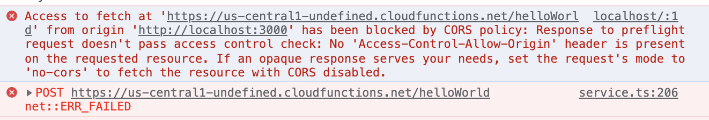

# Bugs and Stuff

## Firebase

### Issue with calling firebase functions?


This issue comes up when you try calling a firebase function from the frontend (React). This literally just means that it does NOT detect any Firebase config in your frontend code. Maybe because of missing .env or just no configuration at all.


### Issue with firebase deploy functions
```
import firebase from 'firebase/compat/app'
^^^^^^

SyntaxError: Cannot use import statement outside a module
    at wrapSafe (internal/modules/cjs/loader.js:979:16)
    at Module._compile (internal/modules/cjs/loader.js:1027:27)
```

This issue is because you may be trying to import the `myFirebase.js` file into functions. Remove it in `index.js`